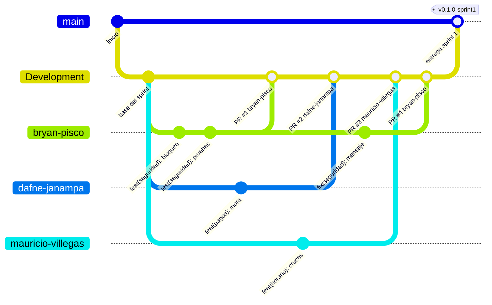

# Flujo de trabajo con Git

Guía práctica para trabajar en este repositorio. El documento oficial es la **sección 8 del Estándar de Programación** (`Estandar_de_Programacion_Grupo2.docx`); esta guía la resume con los comandos que se usan en el día a día.

## 1. Ramas del repositorio

| Rama | Para qué sirve | Cómo recibe cambios |
|---|---|---|
| `main` | Versión que se presenta al cierre de cada sprint. | Solo por Pull Request desde `Development`. |
| `Development` | Integración y prueba del trabajo de todos. Es la rama por defecto. | Solo por Pull Request desde las ramas personales. |
| `nombre-apellido` | Tu rama personal. Solo tú trabajas en ella y nunca se borra. | Tus commits. |

Nadie puede hacer push directo a `main` ni a `Development`.

**Ramas personales**

| Integrante | Rama |
|---|---|
| Mauricio Villegas Basurco | `mauricio-villegas` |
| Oliver Ramirez Barrantes | `oliver-ramirez` |
| Jose Alonso Chisun Fajardo | `jose-chisun` |
| Diego Alonso La Torre Salas | `diego-la-torre` |
| Dafne Yanoa Janampa Flores | `dafne-janampa` |
| Sebastian Alejandro Morales Cayampe | `sebastian-morales` |
| Renato Sebastian Yallahui Quevedo | `renato-yallahui` |
| Jairo Martín Montoya Anco | `jairo-montoya` |
| Bryan Jair Pisco Tarrillo | `bryan-pisco` |

En los comandos de esta guía, reemplaza `<tu-rama>` por la tuya (por ejemplo, `bryan-pisco`).

## 2. Cómo se ve un sprint

Simulación con tres integrantes. Cada uno trabaja en su rama, integra cada tarea terminada en `Development` mediante un Pull Request y, al cierre del sprint, `Development` se integra en `main` con una etiqueta de versión.



Lo que el gráfico no puede dibujar: **antes de cada Pull Request, y cada día, cada integrante hace rebase de su rama sobre `Development`** (sección 4.1). Por eso, en la práctica, los commits de cada rama siempre parten del último estado de `Development`.

## 3. Configuración inicial (una sola vez)

```bash
# Identidad para tus commits (usa el correo de tu cuenta de GitHub)
git config --global user.name "Nombre Apellido"
git config --global user.email "tu-correo@ejemplo.com"

# Clonar el repositorio y cambiarte a tu rama
git clone git@github.com:EducaShow-TA/workflow-backend.git
cd workflow-backend
git switch <tu-rama>
```

Si ya tenías el repositorio clonado:

```bash
git fetch origin
git switch <tu-rama>
```

El proyecto usa **JDK 25**. Si tu JDK por defecto es otro, apunta `JAVA_HOME` a JDK 25 antes de usar Maven (con JDK 27, Spotless falla):

```bash
export JAVA_HOME=/usr/lib/jvm/java-25-openjdk   # ajusta la ruta a tu sistema
java -version
```

## 4. Rutina de trabajo

Resumen del ciclo de cada tarea:

1. Actualizar tu rama con rebase sobre `Development`.
2. Programar y hacer commits pequeños.
3. Formatear, probar, volver a actualizar y subir tu rama.
4. Abrir el Pull Request hacia `Development`.
5. Cuando lo integren, actualizar tu rama otra vez.

### 4.1 Actualizar tu rama

Hazlo **al empezar cada día**, cuando avisen que `Development` cambió y **antes de abrir un Pull Request**:

```bash
git switch <tu-rama>
git fetch origin
git rebase origin/Development
```

**¿Por qué rebase y no merge?** El rebase reubica tus commits encima de la versión más reciente de `Development`, como si hubieras empezado a trabajar recién:

```
ANTES del rebase                          DESPUÉS de git rebase origin/Development

Development  A───B───C                    Development  A───B───C
                  \                                             \
<tu-rama>          X───Y                  <tu-rama>              X'───Y'
```

- El historial queda en línea recta y tu Pull Request muestra solo tus cambios.
- Los conflictos se resuelven en tu rama, no en `Development`.
- Es seguro porque tu rama es solo tuya. **Nunca** hagas rebase de `main` ni de `Development`.

Si tienes cambios sin commitear, Git no te dejará hacer rebase. Haz commit primero o guárdalos temporalmente:

```bash
git stash          # guarda los cambios sin commitear
git rebase origin/Development
git stash pop      # los recupera
```

### 4.2 Hacer commits

Formato (Conventional Commits, sección 8.2 del Estándar):

```
tipo(alcance): descripción breve
```

- **tipo:** uno de los de la tabla.
- **alcance:** módulo afectado (`seguridad`, `pagos`, `horario`, `matricula`, `academico`, `readme`…). Puede omitirse si el cambio no es de un módulo.
- **descripción:** verbo en infinitivo (agregar, corregir, actualizar…), en minúsculas y sin punto final.

| Tipo | Cuándo usarlo |
|---|---|
| `feat` | Nueva funcionalidad. |
| `fix` | Corrección de un error. |
| `docs` | Documentación. |
| `style` | Formato (espacios, indentación) sin cambiar comportamiento. |
| `refactor` | Reorganizar código sin agregar funcionalidad ni corregir errores. |
| `test` | Agregar o modificar pruebas. |
| `chore` | Mantenimiento: dependencias, configuración de herramientas. |

| ✅ Correcto | ❌ Incorrecto |
|---|---|
| `feat(pagos): agregar cálculo automático de mora` | `cambios` |
| `fix(horario): corregir validación de cruce de horarios` | `Fix bug` |
| `test(seguridad): agregar pruebas de bloqueo de cuenta` | `feat: Agregué pruebas.` |
| `docs(readme): actualizar instrucciones de despliegue local` | `avance US-4.1` |

Comandos:

```bash
git status                      # qué archivos cambiaron
git diff                        # qué cambió exactamente
git add <archivo1> <archivo2>   # agrega solo lo que corresponde a este commit
git commit -m "feat(seguridad): agregar bloqueo de cuenta por intentos fallidos"
```

Cada commit debe agrupar cambios relacionados. Si hiciste varias cosas, sepáralas en varios commits agregando los archivos por partes.

Para corregir el mensaje del **último commit, si todavía no lo subiste**:

```bash
git commit --amend -m "fix(pagos): corregir redondeo de mora"
```

### 4.3 Verificar y subir tu rama

```bash
mvn spotless:apply              # aplica el formato del proyecto
mvn verify                      # compila, revisa formato y ejecuta las pruebas
git fetch origin
git rebase origin/Development   # vuelve a actualizarte justo antes de subir
git push --force-with-lease origin <tu-rama>
```

- Si `spotless:apply` modificó archivos, inclúyelos en un commit: `git commit -am "style: aplicar formato del proyecto"`.
- Después de un rebase, el push **necesita** `--force-with-lease`, porque el rebase reescribe tus commits. Esta opción solo reemplaza tu rama remota si nadie más la cambió.
- **Nunca uses `git push --force`.**

### 4.4 Abrir el Pull Request

1. En GitHub, entra al repositorio → **Pull requests** → **New pull request**.
2. Elige **base: `Development`** y **compare: `<tu-rama>`**.
3. **Título** en el mismo formato que los commits, por ejemplo `feat(seguridad): agregar bloqueo de cuenta por intentos fallidos`.
4. **Descripción:** historia de usuario (US-x.x), qué hiciste y cómo probarlo.
5. Pide la revisión a un compañero. Los Pull Requests se revisan en un máximo de 24 horas.

Para integrarse, el Pull Request necesita **1 aprobación de otro integrante**, el **CI en verde** y **ningún comentario sin resolver**. Se integra con **"Create a merge commit"**.

**Mientras tu Pull Request esté abierto**, todo lo que subas a tu rama se agrega a ese mismo Pull Request. Por eso:

- Sube solo las correcciones que te pidan en la revisión.
- Puedes avanzar la siguiente tarea con commits **locales**, pero **no hagas push** hasta que tu Pull Request se integre.

### 4.5 Después de que integren tu Pull Request

```bash
git fetch origin
git rebase origin/Development
git push --force-with-lease origin <tu-rama>
```

Los commits que ya están en `Development` desaparecen de tu lista de pendientes y solo quedan tus commits locales nuevos (si tenías). Tu rama **no se borra**: la sigues usando para la próxima tarea.

## 5. Resolver conflictos durante un rebase

Si dos personas cambiaron las mismas líneas, el rebase se detiene y muestra algo así:

```
CONFLICT (content): Merge conflict in src/main/java/.../AuthServiceImpl.java
```

1. Mira qué archivos tienen conflicto:
   ```bash
   git status
   ```
2. Abre cada archivo. Verás bloques como este:
   ```
   <<<<<<< HEAD
   código que ya está en Development
   =======
   tu código
   >>>>>>> feat(seguridad): agregar bloqueo
   ```
   Deja el código correcto (puede ser una combinación de ambos) y **borra las tres líneas de marcadores**.
3. Marca el archivo como resuelto y continúa:
   ```bash
   git add <archivo>
   git rebase --continue
   ```
   Si hay más commits con conflictos, repite los pasos.
4. Al terminar, verifica que todo funciona antes de subir:
   ```bash
   mvn verify
   git push --force-with-lease origin <tu-rama>
   ```

Si no sabes cómo resolverlo, **cancela el rebase**, que deja tu rama exactamente como estaba, y coordina con el autor del otro cambio:

```bash
git rebase --abort
```

## 6. Entrega de sprint

Al cierre del sprint, un integrante:

1. Abre un Pull Request con **base: `main`** y **compare: `Development`**, con el título `chore(release): entrega sprint N`.
2. Tras la aprobación, lo integra con **"Create a merge commit"**.
3. Crea la etiqueta de la versión presentada:
   ```bash
   git fetch origin
   git switch main
   git pull origin main
   git tag -a v0.1.0-sprint1 -m "Entrega sprint 1"
   git push origin v0.1.0-sprint1
   ```

## 7. Lo que no se debe hacer

| ❌ No hagas esto | ✅ Haz esto |
|---|---|
| Push directo a `main` o `Development` | Pull Request desde tu rama |
| `git merge origin/Development` en tu rama | `git rebase origin/Development` |
| `git push --force` | `git push --force-with-lease origin <tu-rama>` |
| Rebase de `main` o `Development` | Rebase solo de tu rama |
| Commits o push en la rama de otro integrante | Esperar a que su trabajo llegue a `Development` y hacer rebase |
| Crear ramas a partir de tu rama para hacer PR | Hacer el PR directamente desde tu rama |
| Subir `.env`, contraseñas o claves | Usar variables de entorno (ver `README.md`) |

## 8. Problemas frecuentes

**`git push` es rechazado con `non-fast-forward` después de un rebase.**
Es normal: el rebase reescribió tus commits. Usa `git push --force-with-lease origin <tu-rama>`.

**`--force-with-lease` rechaza el push (`stale info`).**
Tu rama remota tiene cambios que no tienes en local (por ejemplo, subiste desde otra computadora). Revisa antes de forzar:
```bash
git fetch origin
git log --oneline <tu-rama>..origin/<tu-rama>   # commits remotos que no tienes
```
Si los necesitas, tráelos con `git rebase origin/<tu-rama>` y luego vuelve a actualizarte sobre `Development`.

**Hice `git merge` de `Development` en mi rama por error.**
Un rebase elimina el commit de merge y deja tu rama en línea recta:
```bash
git fetch origin
git rebase origin/Development
```

**Hice commits en `Development` local por error.**
El push será rechazado. Lleva esos commits a tu rama y deja `Development` como en GitHub:
```bash
git switch <tu-rama>
git cherry-pick origin/Development..Development
git switch Development
git reset --hard origin/Development
git switch <tu-rama>
```

**El CI falló por formato (Spotless).**
```bash
mvn spotless:apply
git commit -am "style: aplicar formato del proyecto"
git push --force-with-lease origin <tu-rama>
```

**Quiero corregir el mensaje de un commit que ya subí.**
Como la rama es tuya, puedes reescribirlo:
```bash
git rebase -i origin/Development     # cambia "pick" por "reword" en el commit a corregir
git push --force-with-lease origin <tu-rama>
```

## 9. Resumen de comandos

```bash
# Empezar el día
git switch <tu-rama>
git fetch origin
git rebase origin/Development

# Trabajar
git add <archivos>
git commit -m "tipo(alcance): descripción"

# Antes de subir
mvn spotless:apply
mvn verify
git fetch origin
git rebase origin/Development
git push --force-with-lease origin <tu-rama>

# Abrir PR en GitHub: base Development ← compare <tu-rama>

# Después de que integren tu PR
git fetch origin
git rebase origin/Development
git push --force-with-lease origin <tu-rama>
```
